# got. - a classifieds website to buy and sell simply

Got (stylised as got.) is a simple and user-friendly online classified ads platform, inspired by classifieds sites like Craigslist, Gumtree and Adverts.ie. The project is designed to provide a platform for individuals who wish to buy, sell, or exchange goods and services.

Source code can be found [here](https://github.com/h-bails/classifieds).

The live project can be viewed [here](https://got-it.herokuapp.com).

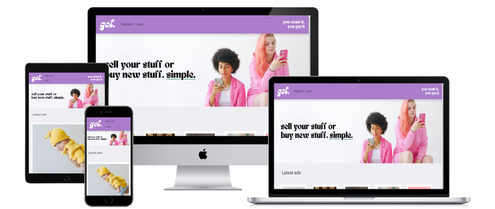


## User Stories

<details>

<summary>EPIC 1: User registration and account management</summary>
<br>
**USER STORY: User registration**
[MUST-HAVE]

- As an unregistered user, I want to register for an account so that I can post ads and manage my posted ads.

**USER STORY: Log in and log out of account**
[MUST HAVE]

- As a registered user, I want to log in to my account so that I can access my posted ads and personal profile. I also want to log out of my account when I am done using the site.

**USER STORY: View my profile**
[MUST HAVE]

- As an authenticated user, I want to be able to view my profile so that I can view my information and posted ads.

**USER STORY: Admin login**
[MUST HAVE]

- As a superuser/admin, I am able to log into the Django admin section of the site to manage users, ads, and categories.

</details>
-----

<details>

<summary>EPIC 2: Creating and posting ads</summary>
<br>
**USER STORY: Create new ad**
[MUST HAVE]
- As a logged-in user, I want to create new ads so that I can sell my items.

**USER STORY: Upload images to ad**
[SHOULD HAVE]
- As a logged-in user, I want to upload images of the items I'm selling so that potential buyers can see the item's condition.

</details>
-----

<details>

<summary>EPIC 3: Managing posted ads</summary>
<br>
**USER STORY: View posted ads**
[MUST HAVE]

- As a logged-in user, I want to view my posted ads so that I can manage them effectively.

**USER STORY: Edit ad**
[MUST HAVE]

- As a logged-in user, I want to edit my ads so that I can update information or fix mistakes.

**USER STORY: Delete ad**
[MUST HAVE]

- As a logged-in user, I want to delete ads so that I can remove items that are no longer available.

**USER STORY: Receive notification when buyer is interested**
[MUST HAVE]

- As a logged-in user, I want to receive notifications when someone is interested in my ad so I can respond promptly.

</details>
-----

<details>

<summary>EPIC 4: Navigation and interaction</summary>
<br>
**USER STORY: Save ads to a list**
[SHOULD HAVE]

- As a user, I want to save ads to a list (e.g. Favourites) so that I can access them easily in future.

**USER STORY: Toggle saved ads**
[SHOULD HAVE]

- As a user, I want to toggle my saved ads so that I can remove them if they are no longer relevant to me.

**USER STORY: Filter ads by category**
[COULD HAVE]

- As a visitor, I want to filter ads by category so that I can view items in specific categories.

**USER STORY: Sort by date or price**
[COULD HAVE]

- As a visitor, I want to sort ads by date or price so that I can view items in my preferred order.

</details>

User story acceptance criteria can be found in TESTING.MD. ***************
## Roadmap

<details>

<summary>Features not included in initial release</summary>

These nonessential features were not added due to time constraints in developing the initial release.

### Epic 1: User registration and account management
USER STORY: Delete my profile
[COULD HAVE]
As an authenticated user, I want to be able to delete my profile if I no longer wish to be registered with the site.
           
### Epic 3: Managing posted ads
USER STORY: Mark as 'unavailable'
[WON’T HAVE]
As a logged-in user, I want to mark my ads as "unavailable" so that I can inform other potential buyers of the item's status without deleting the ad entirely. (This is useful in case a sale falls through, for example).

### Epic 4: Navigation and interaction
USER STORY: Search by keyword
[WON’T HAVE]
As a visitor, I want to search for ads by keywords so that I can find items I'm interested in.

USER STORY: Review buyers and sellers
[WON’T HAVE]
As a logged-in user, I want to rate and review other sellers or buyers so that I can provide feedback and help build trust within the community.

</details>
## Design

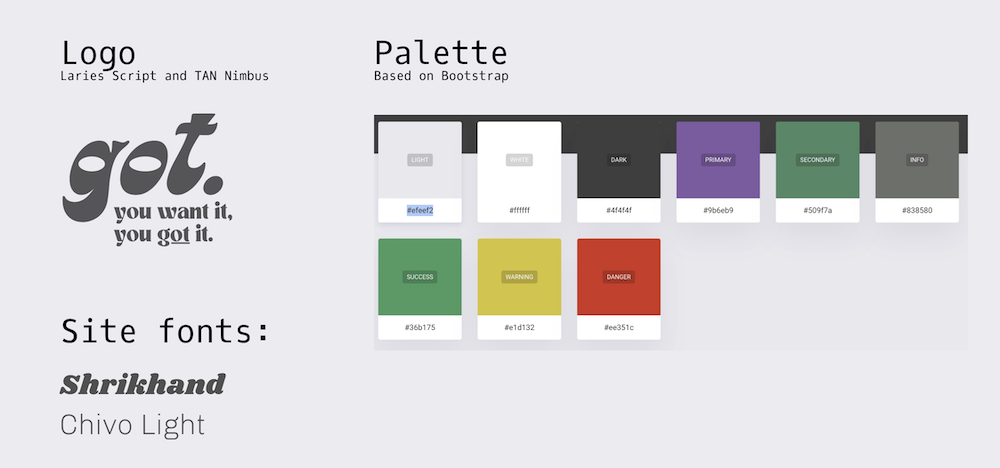

### Colour Scheme
I wanted to use complimentary colours for the site, that were bright and fun. I selected mid-tones of purple and green. 

### Typography
I selected Chivo for the body font and Shrikhand for the major headings, complemented by Laries Script and TAN Nimbus in the logo and slogan.

### Imagery
I used imagery from Pexels.com throughout the site. I tried to keep the imagery high quality, trendy and colourful.

### Entity Relationship Diagrams
ERDs were drawn up before backend development started, using Figma.

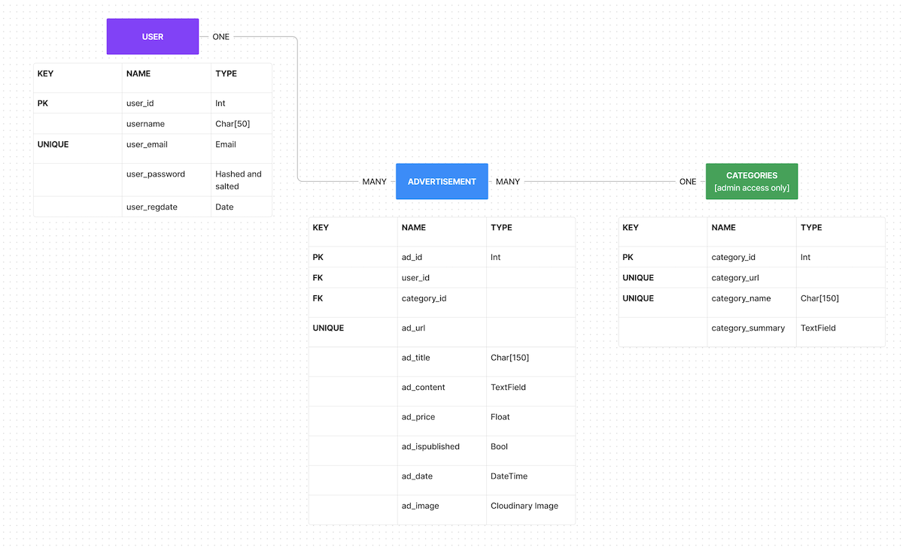

### Wireframes
Wireframes were drawn up before front-end development started, using Figma.

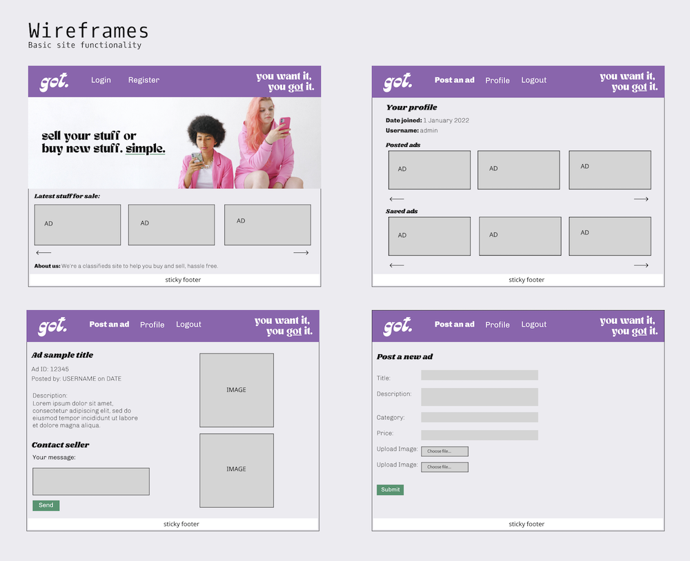
## Features

## Homepage and base template
***Top nav***

The top nav contains links to login or register if the user is not authenticated. If they are, it contains options to create a new ad, view your profile, or logout. The logo and a slogan are displayed in the imagery.

***Homepage hero section***
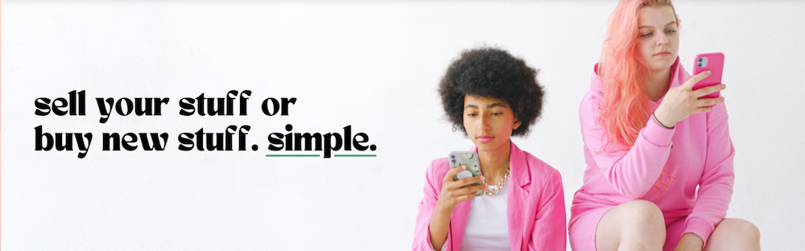
A hero image section provides a pop of colour and trendy, engaging imagery to welcome the user to the site.

***Messages section***
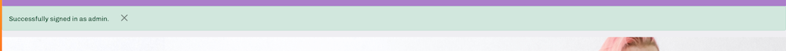
Messages and user feedback are displayed underneath the top nav.

***Latest ads***
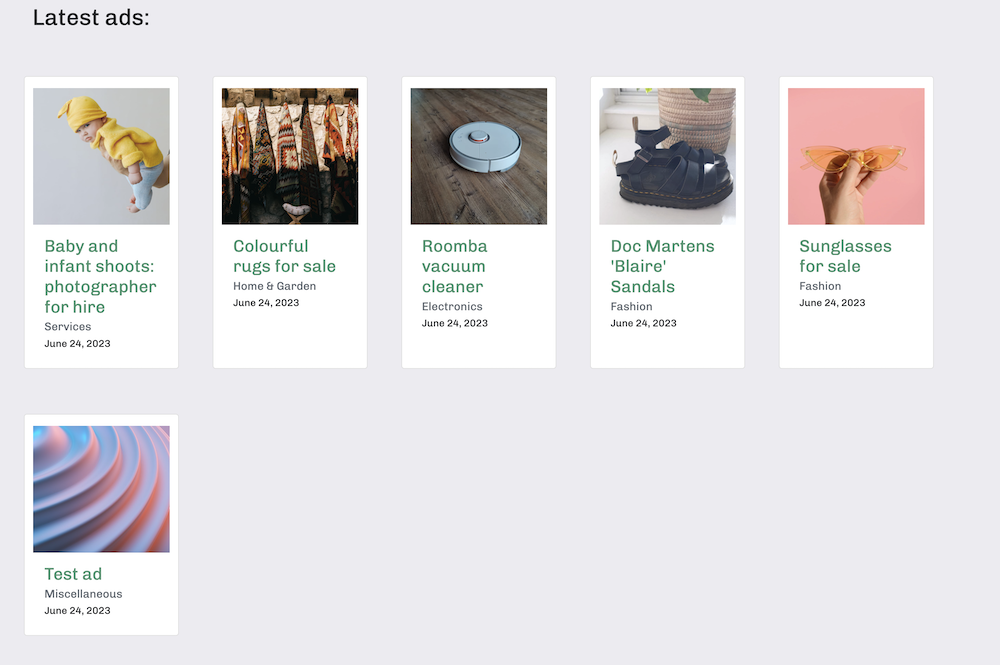
This is where the latest created ads appear, arranged by the most recent.

***Footer***

Contains developer credits and demo social media links.

## Sign-in and sign-out pages

These are the standard AllAuth templates which I styled a bit to match the aesthetic of the site.
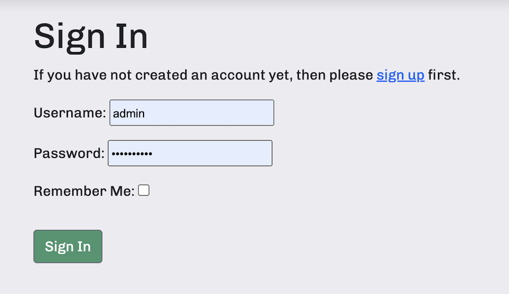
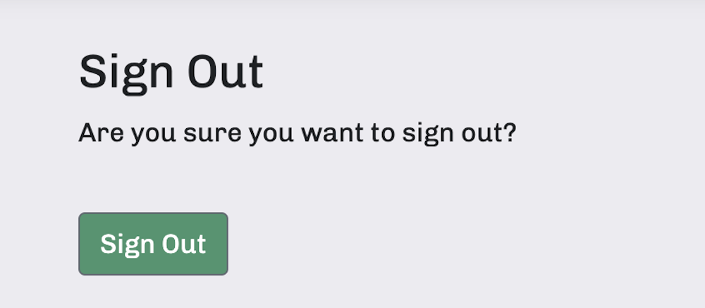
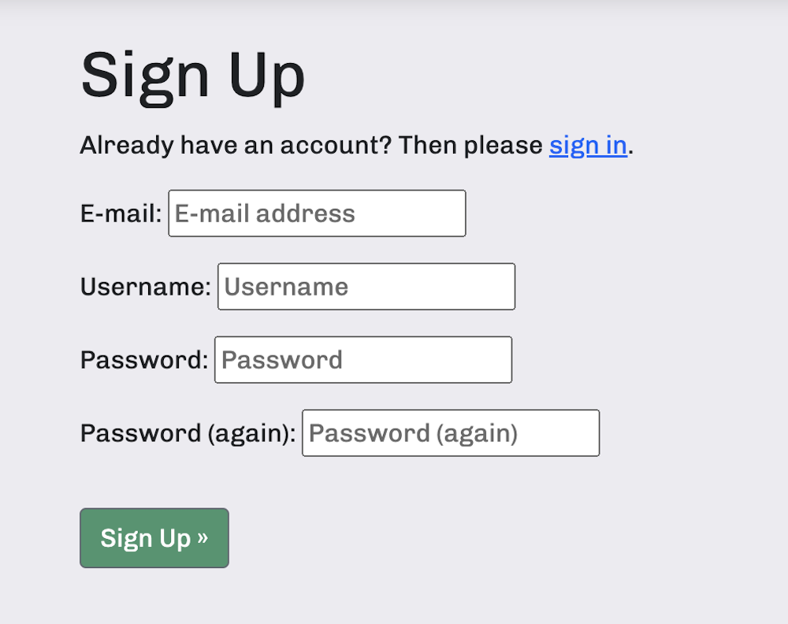

## Profile page
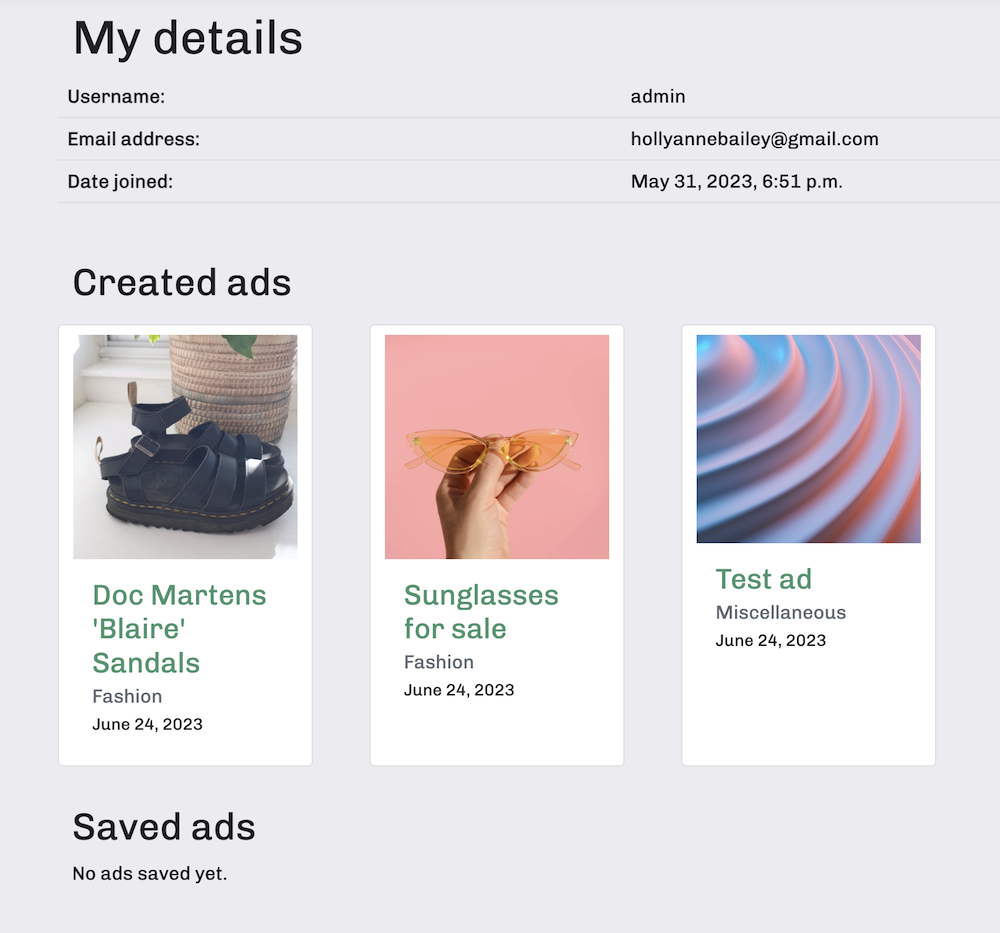
The profile page contains basic user information, as well as a list of the ads the user has edited and the ads the user has saved.

### New Ad page
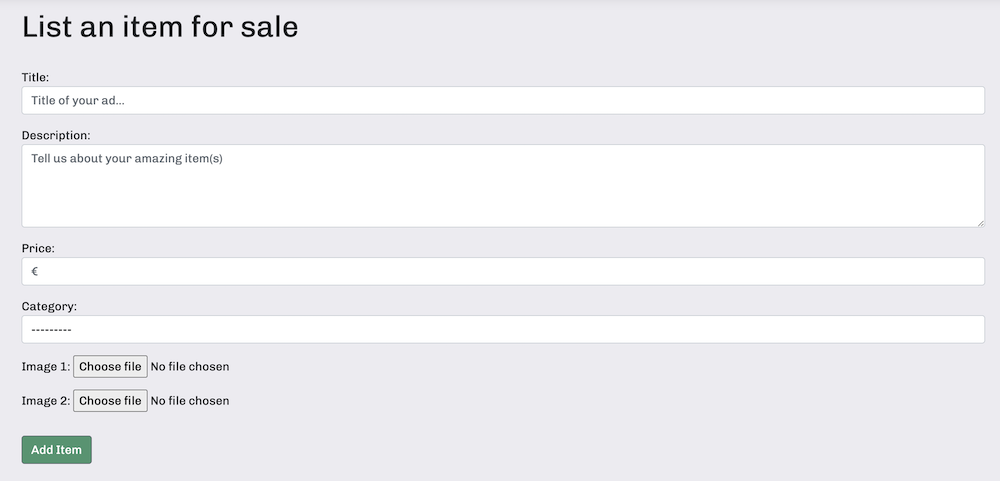
This form allows the user to create a new ad and upload the relevant images which will be hosted on Cloudinary.

### Ad Detail page
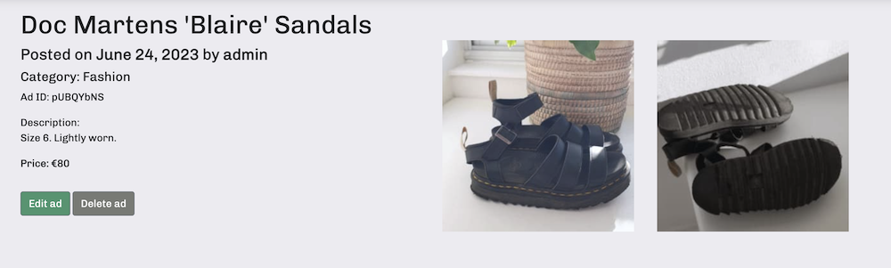
If the ad was created by the user, they have an option to edit the ad or delete it.
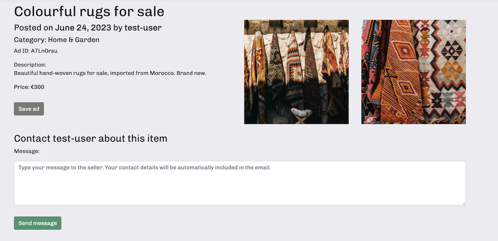
If the ad was not created by the user, they have an option to save the ad or send a message.

## Edit Ad page
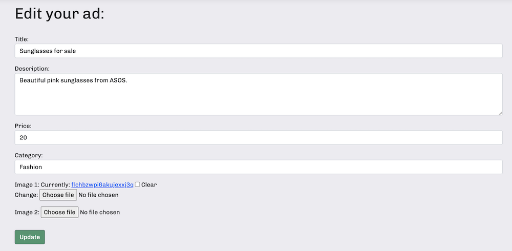
Users can access a form to edit ads that they have created.

## Edit Ad page

Users can access a form to edit ads that they have created.

## Tech Stack
**Languages:** 
Python, HTML, CSS and some inline Javascript.

**Packages and programs:** 
- Cloudinary was used for image story and hosting.
- Allauth was used for user login and authentication.
- Gunicorn was used for project deployment.
- ElephantSQL was used for the database.
- Amazon SES was used to email users ad enquiries.
- Bootstrap was used to assist with the responsiveness and styling of the website.
- Git was used for version control.
- GitHub was used to store the project's code after being pushed from Git.

## Testing

Testing documentation is available at . *****TO UPDATE*****


## Deployment

### Installation and setup
Clone the repository to your local machine:
```bash
git clone https://github.com/h-bails/classifieds.git
```

To isolate your project and its dependencies from other projects, it's a good practice to use a virtual environment. Find instructions on how to do this [here](https://docs.python.org/3/library/venv.html).


Once your venv is activated, install the required packages:
```bash
pip install -r requirements.txt
```

### Deploying to Heroku
1. Log into your Heroku account.
2. Create a new app.
3. Choose a unique app name and add your location.
4. From the Resources section, select Heroku Postgres.
5. From the Deploy section, connect to Github and search for your repository. You can also enable automatic deployment if you wish.
6. From the Settings tab, reveal the Config Vars and add your Cloudinary and database URLs and secret keys, as well as your Amazon SES credentials.
7. You're ready to deploy!

## Acknowledgements

### Media 
- All images courtesy of [pexels.com](pexels.com)
- Logo, slogan and hero image artwork via [Canva](canva.com)
- Wireframes were done in [Figma](figma.com)
- [Google Fonts](fonts.google.com) was used to import the fonts that were used style.css file which is used on all pages throughout the project.
- [Font Awesome](fontawesome.com) was used to add icons to the footer.

### Features and bug fixes
- Thanks to the Code Institute team for this [Django blog walkthrough](https://github.com/Code-Institute-Solutions/Django3blog/), which I was able to use as a base for this project.
- **Other blog posts and resources that helped me:**
    - [Unique, but obfuscated URLs in Django](https://alldjango.com/tips/unique-obfuscated-urls-django)
    - [Sending emails in Django using SMTP](https://opensource.com/article/22/12/django-send-emails-smtp)
    - [How to validate an uploaded image in Python Django](https://pythoncircle.com/post/773/how-to-validate-an-uploaded-image-in-python-django/)
    - [Styling Django forms](https://medium.com/swlh/how-to-style-your-django-forms-7e8463aae4fa)


### Misc
- I'd like to thank my mentor, Daisy McGirr, for her input and help with my environment variables, database, Procfile, best practices and security.
- [Readme.so](readme.so) made it much easier to write this Readme!

