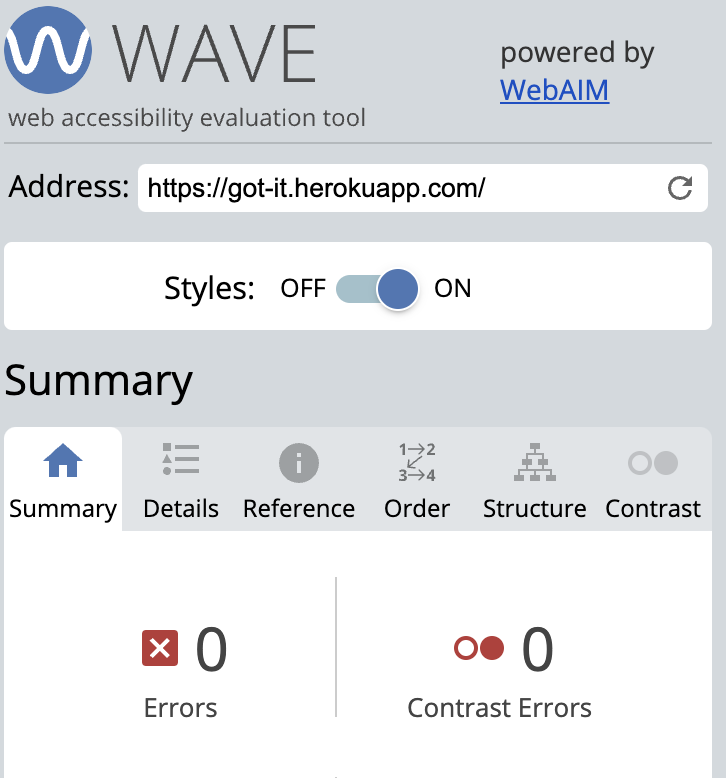
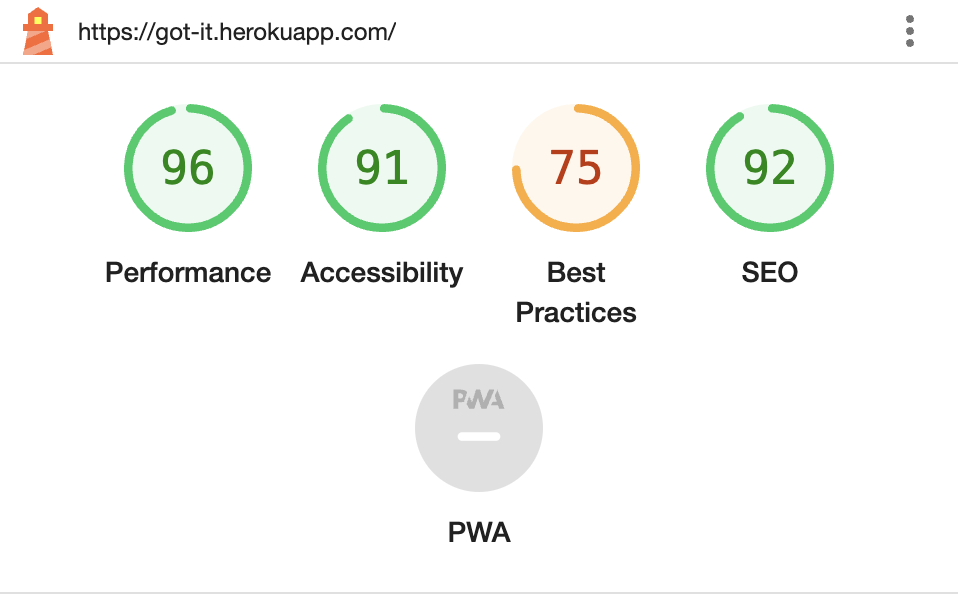

# How **got.** was tested

Back to [README.MD](README.MD) 

## Manual Testing

I manually inspected each feature or component of the application to ensure they were functioning as anticipated. Each user story had specific user acceptance criteria that needed to be met for the feature to be successfully implemented. 

## Automated Testing

I wrote scripts that automatically test key features of the application. 

## Accessibility

I ran the program through the AIM accessibility checker to ensure the site adhered to WCAG best practices.

## Responsiveness

I ensured that the application was responsive by checking its look and functionality across a variety of devices and screen sizes.

## Compatability

I made sure that the application worked with different web browsers (Chrome, Firefox, Safari) and  operating systems (Windows, macOS).

## Code validation

I used the following programs nad linters to ensure the code met specific standards.

HTML
CSS
PYTHON

## Performance

I ran a Lighthouse report to make sure that the application responded quickly.

## Bugs fixed

I fixed several bugs during the course of the project.

- Email/messaging functionality:
    - I originally wanted to use the django-messages private messaging package, but this is [not maintained](https://github.com/arneb/django-messages/issues) and thus not compatible with newer versions of Django and Python. This was a good lesson in making sure more 'niche' packages are well maintained before installing them, otherwise they may cause a risk to app security and functionality.
    - I then went on to install Amazon SES for sending emails, which worked well in testing, but I was not successful in requesting that my account be moved from sandbox to production mode, I could only send emails to email adresses I could prove as my own. This is obviously impractical in a live app. 
    - My current email sending functionality sends directly from a personal Google account via SMTP - this is fine for a MVP but would not be ideal in a larger scale app in production.
- Bug fixed: '/save/' remains in url after ad saves and unsaves, and causes contact form to disappear. Fixed by properly configuring the relevant return(request) in the save_ad function views.py.
- Bug fixed: Multiple blocks of messages appearing: Caused by having a tag to display messages at the top of base.html, as well as a seperate div where messages were displayed.

Back to [README.MD](README.MD) 
