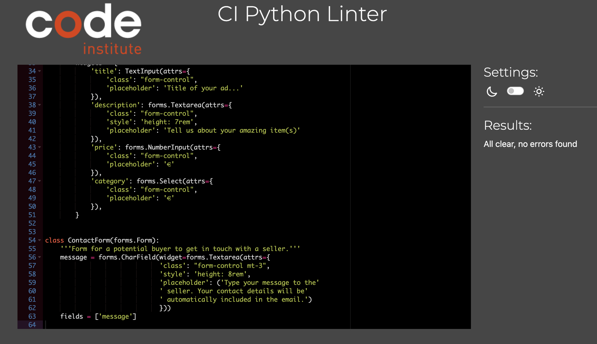

# How **got.** was tested

Back to [README.MD](README.MD) 

## Manual Testing

I manually inspected each feature or component of the application to ensure they were functioning as anticipated. Each user story had specific user acceptance criteria that needed to be met for the feature to be successfully implemented.

| **Epic 1: User registration and account management**                                                                                                                                                                          |RESULT|
|--------------------------------------------------------------------------------------------------------------------------------------------------------------------------------------------------------------------------|------|
|                                                                                                                                                                                                                          |      |
| :arrow_forward: ***USER STORY: User registration***                                                                                                                                                                                             |      |
|*MUST-HAVE*                                                                                                                                                                                                                 |      |
|As an unregistered user, I want to register for an account so that I can post ads and manage my posted ads.                                                                                                               |      |
|                                                                                                                                                                                                                          |      |
| :white_check_mark: ***ACCEPTANCE Criteria:***                                                                                                                                                                                                    |      |
|The user is able to navigate to a registration page from the homepage.                                                                                                                                                    |PASS  |
|The user sees a registration form asking for username, email, and password.                                                                                                                                               |PASS  |
|The user can submit the registration form.                                                                                                                                                                                |PASS  |
|If the form input is valid, a new account is created, and the user is redirected to the homepage.                                                                                                                         |PASS  |
|If the form input is invalid, the user is shown an error message and can correct their input.                                                                                                                             |PASS  |
|If the username already exists, an error message is displayed, and the user can correct their input. (The site allows multiple usernames to be registered off the same email).                                            |PASS  |
|                                                                                                                                                                                                                          |      |
| :arrow_forward: ***USER STORY: Log in and log out of account***                                                                                                                                                                                 |      |
|*MUST HAVE*                                                                                                                                                                                                                 |      |
|As a registered user, I want to log in to my account so that I can access my posted ads and personal profile. I also want to log out of my account when I am done using the site.                                         |      |
|                                                                                                                                                                                                                          |      |
| :white_check_mark: ***ACCEPTANCE Criteria:***                                                                                                                                                                                                      |      |
|The user is able to navigate to a login page from the homepage.                                                                                                                                                           |PASS  |
|The user sees a login form asking for username/email and password.                                                                                                                                                        |PASS  |
|The user is able to submit the login form.                                                                                                                                                                                |PASS  |
|If the input is valid, the user is logged in and redirected to their dashboard.                                                                                                                                           |PASS  |
|If the input is invalid, the user is shown an error message and can correct their input.                                                                                                                                  |PASS  |
|When the user is logged in, they see a ‘Logout’ option on their navigation bar.                                                                                                                                           |PASS  |
|The user is able to log out when clicking on ‘Logout’ and is redirected to the homepage.                                                                                                                                  |PASS  |
|The logged-out user is able to login again after logging out.                                                                                                                                                             |PASS  |
|                                                                                                                                                                                                                          |      |
| :arrow_forward: ***USER STORY: View my profile***                                                                                                                                                                                               |      |
|*MUST HAVE*                                                                                                                                                                                                                 |      |
|As an authenticated user, I want to be able to view my profile so that I can view my information and posted ads.                                                                                                          |      |
|                                                                                                                                                                                                                          |      |
| :white_check_mark: ***ACCEPTANCE Criteria:***                                                                                                                                                                                                      |      |
|The user is able to navigate to their profile page after logging in.                                                                                                                                                      |PASS  |
|On the profile page, the user sees their username, email, and list of posted ads and saved ads (the latter will be added in a later epic).                                                                                |PASS  |
|                                                                                                                                                                                                                          |      |
| :arrow_forward: ***USER STORY: Admin login***                                                                                                                                                                                                   |      |
|*MUST HAVE*                                                                                                                                                                                                                 |      |
|                                                                                                                                                                                                                          |      |
|As a superuser/admin, I am able to log into the Django admin section of the site to manage users, ads, and categories.                                                                                                    |      |
|                                                                                                                                                                                                                          |      |
| :white_check_mark: ***ACCEPTANCE criteria:***                                                                                                                                                                                                      |      |
|The website includes a designated admin login URL (<https://got-it.herokuapp.com/admin/>).                                                                                                                                  |PASS  |
|When navigated to the admin login URL, an admin login form is presented.                                                                                                                                                  |PASS  |
|The admin login form includes fields for username and password.                                                                                                                                                           |PASS  |
|The form rejects incorrect admin login credentials and presents an error message.                                                                                                                                         |PASS  |
|The form accepts correct admin login credentials and directs the user to the admin dashboard.                                                                                                                             |PASS  |
|The admin dashboard presents options to manage users, ads, and categories.                                                                                                                                                |PASS  |
|The admin can successfully log out from the admin dashboard and is redirected to the homepage.                                                                                                                            |PASS  |
||      |
| **Epic 2: Creating and posting ads**                                                                                                                                                                                          |      |
|                                                                                                                                                                                                                          |      |
| :arrow_forward: ***USER STORY: Create new ad***                                                                                                                                                                                               |      |
|*MUST HAVE*                                                                                                                                                                                                                 |      |
|As a logged-in user, I want to create new ads so that I can sell my items.                                                                                                                                                |      |
|                                                                                                                                                                                                                          |      |
| :white_check_mark: ***ACCEPTANCE Criteria:***                                                                                                                                                                                                      |      |
|The user is able to navigate to a "Post New Ad" page from their dashboard.                                                                                                                                                |PASS  |
|The user sees a form to enter details about the item they're selling.                                                                                                                                                     |PASS  |
|The user can submit the form to create the ad.                                                                                                                                                                            |PASS  |
|If the form input is valid, the ad is created and displayed on the homepage, and in the user's list of posted ads.                                                                                                        |PASS  |
|If the form input is invalid, the user is shown an error message and can correct their input.                                                                                                                             |PASS  |
|                                                                                                                                                                                                                          |      |
| :arrow_forward: ***USER STORY: Upload images to ad***                                                                                                                                                                                           |      |
|*SHOULD HAVE*                                                                                                                                                                                                               |      |
|As a logged-in user, I want to upload images of the items I'm selling so that potential buyers can see the item's condition.                                                                                              |      |
|                                                                                                                                                                                                                          |      |
| :white_check_mark: ***ACCEPTANCE Criteria:***                                                                                                                                                                                                      |      |
|The user sees an "Upload Images" option when creating or editing an ad.                                                                                                                                                   |PASS  |
|The user can select an image from their device to upload.                                                                                                                                                                 |PASS  |
|The uploaded images are displayed as part of the ad.                                                                                                                                                                      |PASS  |
|The user can remove any of the uploaded images.                                                                                                                                                                           |PASS  |
|If the user tries to upload the wrong file type, they are shown an error message.                                                                                                                                         |PASS  |
|The user is able to submit the form whether uploading one image, two images, or no images.                                                                                                                                |PASS  |
|The images are automatically cropped and resized by Cloudinary upon upload.                                                                                                                                               |PASS  |
|                                                                                                                                                                                                                          |      |
| **Epic 3: Managing posted ads**                                                                                                                                                                                               |      |
|                                                                                                                                                                                                                          |      |
| :arrow_forward: ***USER STORY: View posted ads***                                                                                                                                                                                               |      |
|*MUST HAVE*                                                                                                                                                                                                                 |      |
|As a logged-in user, I want to view my posted ads so that I can manage them effectively.                                                                                                                                  |      |
|                                                                                                                                                                                                                          |      |
| :white_check_mark: ***ACCEPTANCE Criteria:***                                                                                                                                                                                                      |      |
|The user can see a list of their active ads on their profile.                                                                                                                                                             |PASS  |
|Each ad in the list includes key details like the title, price, and date posted.                                                                                                                                          |PASS  |
|The user can click on an an ad to view its full details, edit it, or delete it.                                                                                                                                           |PASS  |
|The user is able to view the posted ads of other users, but does not have the option to edit or delete the ad.                                                                                                            |PASS  |
|                                                                                                                                                                                                                          |      |
|                                                                                                                                                                                                                          |      |
| :arrow_forward: ***USER STORY: Edit ad***                                                                                                                                                                                                       |      |
|*MUST HAVE*                                                                                                                                                                                                                 |      |
|As a logged-in user, I want to edit my ads so that I can update information or fix mistakes.                                                                                                                              |      |
|                                                                                                                                                                                                                          |      |
| :white_check_mark: ***ACCEPTANCE Criteria:***                                                                                                                                                                                                      |      |
|The user is able to navigate to an "Edit Ad" page when viewing a posted ad.                                                                                                                                               |PASS  |
|The user sees a form populated with the current details of the ad.                                                                                                                                                        |PASS  |
|The user can change the details and submit the form to update the ad.                                                                                                                                                     |PASS  |
|If the form input is valid, the ad is updated and the user is redirected to the ad's detail page.                                                                                                                         |PASS  |
|If the form input is invalid, the user is shown an error message and can correct their input.                                                                                                                             |PASS  |
|                                                                                                                                                                                                                          |      |
| :arrow_forward: ***USER STORY: Delete ad***                                                                                                                                                                                                     |      |
|*MUST HAVE*                                                                                                                                                                                                                 |      |
|As a logged-in user, I want to delete ads so that I can remove items that are no longer available.                                                                                                                        |      |
| :white_check_mark: ***ACCEPTANCE Criteria:***                                                                                                                                                                                                      |      |
|The user is able to navigate to a "Delete Ad" option for each of their posted ads.                                                                                                                                        |PASS  |
|Upon selecting "Delete Ad", the user is asked to confirm their decision.                                                                                                                                                  |PASS  |
|If the user confirms the deletion, the ad is deleted and removed from their list of posted ads.                                                                                                                           |PASS  |
|If the user cancels the deletion, the ad remains live.                                                                                                                                                                    |PASS  |
|                                                                                                                                                                                                                          |      |
| :arrow_forward: ***USER STORY: Receive notification when buyer is interested***                                                                                                                                                                 |      |
|*MUST HAVE*                                                                                                                                                                                                                 |      |
|As a logged-in user, I want to receive notifications when someone is interested in my ad so I can respond promptly.                                                                                                       |      |
|                                                                                                                                                                                                                          |      |
| :white_check_mark: ***ACCEPTANCE Criteria:***                                                                                                                                                                                                      |      |
|Ads that are not created by the logged-in user have a contact form available for a potential buyer to express their interest.                                                                                             |PASS  |
|Users are able to submit a short message via the contact form.                                                                                                                                                            |PASS  |
|When a buyer expresses interest in an ad via the contact form, the seller receives a notification via email.                                                                                                              |PASS  |
|The email includes key details about the interested buyer and the relevant ad.                                                                                                                                            |PASS  |
|                                                                                                                                                                                                                          |      |
| **Epic 4: Navigation and interaction**                                                                                                                                                                                        |      |
|                                                                                                                                                                                                                          |      |
| :arrow_forward: ***USER STORY: Save ads to a list***                                                                                                                                                                                            |      |
|*SHOULD HAVE*                                                                                                                                                                                                               |      |
|As a user, I want to save ads to a list (e.g. Favourites) so that I can access them easily in future.                                                                                                                     |      |
|                                                                                                                                                                                                                          |      | 
| :white_check_mark: ***ACCEPTANCE Criteria:***                                                                                                                                                                                                      |      |
|While viewing an ad's details, the user can click a button to save the ad to a list.                                                                                                                                      |PASS  |
|The user can view their list of saved ads from their profile.                                                                                                                                                             |PASS  |
|      |
| :arrow_forward: ***USER STORY: Toggle saved ads***                                                                                                                                                                                              |      |
|*SHOULD HAVE*                                                                                                                                                                                                               |      |
|As a user, I want to toggle my saved ads so that I can remove them if they are no longer relevant to me.                                                                                                                  |      |
|                                                                                                                                                                                                                          |      |
| :white_check_mark: ***ACCEPTANCE Criteria:***                                                                                                                                                                                                      |      |
|The user can click a button or link to remove an ad from their ‘Saved Ads’ list.                                                                                                                                          |PASS  |
|Removed ads no longer appear in the list.                                                                                                                                                                                 |PASS  |

## Automated Testing

Automated testing was not utilized for the inital release, but it will be used to test key features in future iterations. 

## Accessibility

I ran the program through the AIM accessibility checker to ensure the site adhered to WCAG best practices.

## Responsiveness

I ensured that the application was responsive by checking its look and functionality across a variety of devices and screen sizes. Standard Bootstrap breakpoints were used to ensure a responsive experience for users, ensuring the app was developed in a mobile-first manner.

Here is a short video demonstrating the site's responsiveness:

## Compatability

I made sure that the application worked with different web browsers (Chrome, Firefox, Safari) and  operating systems (Windows, macOS).

The following browsers were tested:
- Chrome
- Safari
- Firefox

The following OSs were tested:
- Mac
- Windows
- ChromeOS

## Code validation

I used the following programs and linters to ensure the code met specific standards.

**HTML**

The live site pages successfully went through the W3 HTML validator.
- [Homepage](https://validator.w3.org/nu/?doc=https%3A%2F%2Fgot-it.herokuapp.com%2F)
- [Profile page](https://validator.w3.org/nu/?doc=https%3A%2F%2Fgot-it.herokuapp.com%2Fprofile)
- [New Ad page](https://validator.w3.org/nu/?doc=https%3A%2F%2Fgot-it.herokuapp.com%2Fnew_ad%2F)

Any pages that required authentication to access were manually passed through the validator with no issues.

**CSS**

No errors were found when passing the site through the W3C CSS valdiator.
[Link to report](https://jigsaw.w3.org/css-validator/validator?uri=https%3A%2F%2Fgot-it.herokuapp.com%2F&profile=css3svg&usermedium=all&warning=1&vextwarning=&lang=en)

**Python**

The following files were passed through the Code Insitute PEP8 linter with no issues:
- views.py
  
  
  
- models.py

  

- forms.py

  

- urls.py

  

Some structural files were not passed through the linter, namely settings.py.

## Performance

I ran a Lighthouse report to make sure that the application responded quickly.

Desktop:

Mobile:

## Bugs fixed

I fixed several bugs during the course of the project.

- Email/messaging functionality:
    - I originally wanted to use the django-messages private messaging package, but this is [not maintained](https://github.com/arneb/django-messages/issues) and thus not compatible with newer versions of Django and Python. This was a good lesson in making sure more 'niche' packages are well maintained before installing them, otherwise they may cause a risk to app security and functionality.
    - I then went on to install Amazon SES for sending emails, which worked well in testing, but I was not successful in requesting that my account be moved from sandbox to production mode, I could only send emails to email adresses I could prove as my own. This is obviously impractical in a live app. 
    - My current email sending functionality sends directly from a personal Google account via SMTP - this is fine for a MVP but would not be ideal in a larger scale app in production.
- Bug fixed: '/save/' remains in url after ad saves and unsaves, and causes contact form to disappear. Fixed by properly configuring the relevant return(request) in the save_ad function views.py.
- Bug fixed: Multiple blocks of messages appearing: Caused by having a tag to display messages at the top of base.html, as well as a seperate div where messages were displayed.

Back to [README.MD](README.MD) 
